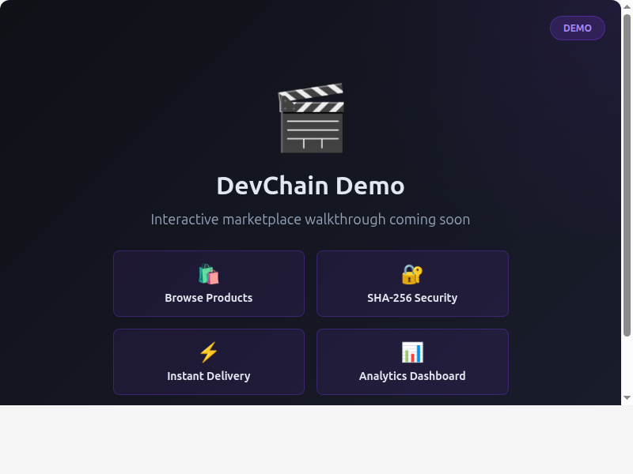

<p align="center">
  <h1 align="center">DevChain 🚀</h1>
  <p align="center">
    <strong>The Developer Marketplace with SHA-256 Verified Ownership</strong> — Sell digital products & services with verifiable ownership certificates
  </p>
</p>

<p align="center">
  <a href="https://github.com/your-org/devchain/stargazers">
    
  </a>
  <a href="https://devchain-app.vercel.app">
    
  </a>
  <a href="https://devchain.onrender.com/api/v1">
    
  </a>
  <a href="https://github.com/your-org/devchain/blob/main/LICENSE">
    
  </a>
  
  
  
  
  
</p>

<p align="center">
  
  <br>
  <em>🎥 Demo: Browse products, purchase with Stripe, and get instant SHA-256 ownership certificates</em>
  <br>
  <small><a href="assets/demo-instructions.md">📹 Learn how to create the full demo GIF</a></small>
</p>

DevChain is a next-generation marketplace where developers can sell digital products, offer services, and connect with clients — all secured by SHA-256 cryptographic ownership verification.

## ✨ Features

- **🛍️ Sell Digital Products**: Templates, tools, courses, scripts, design assets with instant delivery
- **🔐 SHA-256 Verified Ownership**: Every purchase gets a verifiable cryptographic certificate
- **📊 Real-time Analytics**: Track sales, revenue, and performance metrics
- **⚡ Instant File Delivery**: Automated upload/download via Supabase Storage
- **🌐 Full-Stack TypeScript**: Web + mobile apps with end-to-end type safety
- **💼 Services Marketplace**: Post jobs, hire developers, manage projects securely

## 🚀 Quick Start

Get up and running in **3 simple steps**:

### Step 1: Install Dependencies

```bash
# Install all workspace dependencies
npm run install:all
```

### Step 2: Configure Environment

```bash
# Copy environment templates
cp .env.example .env
cp backend/.env.example backend/.env

# Edit backend/.env with your credentials:
# - DATABASE_URL (PostgreSQL connection string)
# - JWT_SECRET & JWT_REFRESH_SECRET
# - SUPABASE_URL & SUPABASE_SERVICE_KEY
# - STRIPE_SECRET_KEY & STRIPE_WEBHOOK_SECRET
```

### Step 3: Start Development Servers

```bash
# Terminal 1: Backend API
npm start              # http://localhost:10000

# Terminal 2: Web App
cd apps/web
npm run dev            # http://localhost:5173

# Terminal 3: Mobile App (optional)
cd apps/mobile
npm run start          # Expo dev server
```

**🎉 That's it!** You're now running DevChain locally. Visit `http://localhost:5173` to see the marketplace in action.

---

## 🏗️ Architecture Overview

```
devchain/
├── apps/
│   ├── web/           # React 19 + TypeScript + Vite
│   └── mobile/        # React Native + Expo
├── backend/           # Node.js + Express + Prisma
├── packages/
│   └── shared/        # Shared types and utilities
└── docs/              # Documentation
```

### 📊 Tech Stack

| Layer          | Technology                   | Purpose                          |
| -------------- | ---------------------------- | -------------------------------- |
| **Frontend**   | React 19 + TypeScript + Vite | Modern web app with type safety  |
| **Mobile**     | React Native + Expo          | Cross-platform mobile experience |
| **Backend**    | Node.js + Express            | RESTful API server               |
| **Database**   | PostgreSQL + Prisma          | Type-safe database operations    |
| **Storage**    | Supabase Storage             | Secure file upload/download      |
| **Auth**       | JWT + bcrypt                 | Secure authentication system     |
| **Deployment** | Vercel + Render              | Scalable cloud infrastructure    |

## 🎯 Core Features

### 🛒 Marketplace

- Browse and search digital products
- Filter by category, price, tags
- Secure checkout with SHA-256 ownership verification

### 👨‍💼 Seller Dashboard

- **Analytics**: Revenue tracking, sales performance
- **Product Management**: Create, edit, manage listings
- **File Delivery**: Automated upload/download system

### 💼 Job Board

- Post development jobs
- Apply with proposals
- Hire developers securely

### 🔐 Authentication

- JWT-based auth with refresh tokens
- Protected routes with role-based access
- Secure file access controls

## 📋 API Reference

The REST API follows consistent patterns:

### Base URL

```
https://devchain.onrender.com/api/v1
```

### Key Endpoints

| Method | Endpoint              | Description                | Auth Required |
| ------ | --------------------- | -------------------------- | ------------- |
| `GET`  | `/products`           | List products with filters | ❌            |
| `POST` | `/products`           | Create new product         | ✅ Seller     |
| `GET`  | `/products/:id`       | Get product details        | ❌            |
| `GET`  | `/products/seller/me` | Get seller's products      | ✅ Seller     |
| `POST` | `/auth/login`         | User login                 | ❌            |
| `POST` | `/auth/register`      | User registration          | ❌            |
| `GET`  | `/auth/me`            | Get current user           | ✅            |

### Example: Create Product

```javascript
POST /api/v1/products
Authorization: Bearer <token>
Content-Type: application/json

{
  "title": "React Dashboard Template",
  "description": "Modern dashboard with dark mode support",
  "price": 29.99,
  "category": "templates",
  "tags": ["react", "dashboard", "typescript"],
  "previewUrl": "https://github.com/example/repo"
}
```

## ⚙️ Configuration

### Environment Variables

#### Root (.env)

| Variable   | Description      | Default       |
| ---------- | ---------------- | ------------- |
| `NODE_ENV` | Environment mode | `development` |

#### Backend (backend/.env)

| Variable                 | Description                  | Required |
| ------------------------ | ---------------------------- | -------- |
| `DATABASE_URL`           | PostgreSQL connection string | ✅       |
| `JWT_SECRET`             | JWT signing secret           | ✅       |
| `JWT_REFRESH_SECRET`     | Refresh token secret         | ✅       |
| `JWT_EXPIRES_IN`         | Access token expiry          | `15m`    |
| `JWT_REFRESH_EXPIRES_IN` | Refresh token expiry         | `7d`     |
| `PORT`                   | Server port                  | `10000`  |
| `SUPABASE_URL`           | Supabase project URL         | ✅       |
| `SUPABASE_SERVICE_KEY`   | Supabase service role key    | ✅       |

## 🧪 Testing

The backend has **183 integration tests** across **14 test suites** covering every API endpoint.

### Backend Testing

```bash
# Run all backend tests (from monorepo root or backend/)
npm test

# Run with coverage report
cd backend && npx jest --coverage

# Run a specific test suite
cd backend && npx jest tests/routes/auth.test.js
cd backend && npx jest tests/routes/jobs.test.js
cd backend && npx jest tests/routes/ownership.test.js
```

**Test suites (14 total, 183 tests):**

| Suite | Tests | Covering |
|-------|-------|----------|
| `errors` | 24 | 8 error classes (BadRequest, Unauthorized, etc.) |
| `asyncHandler` | 3 | Success & error forwarding |
| `validate` | 13 | Body/query/params Joi validation |
| `auth` | 11 | JWT protect + optionalAuth middleware |
| `errorHandler` | 20 | Prisma, JWT, Stripe, Multer, Supabase errors |
| `cors` | 3 | Dev mode, preflight |
| `health` | 3 | DB health check, API info |
| `auth` routes | 17 | Register, login, me, refresh |
| `products` | 14 | CRUD, search, filter, seller dashboard |
| `jobs` | 33 | List/search/filter, get, create, proposals, close |
| `ownership` | 15 | Certificate verify, purchase, purchases, sales |
| `uploads` | 17 | Upload/download/info, multer, access control |
| `payments` | 10 | Checkout session, webhooks |
| `analytics` | 4 | Seller analytics, comparisons, empty state |

### Frontend

```bash
cd apps/web
npm run lint          # Run ESLint
npm run lint -- --fix # Auto-fix lint issues
```

### End-to-End Testing

```bash
# Test the complete purchase flow
# 1. Start backend server
npm start

# 2. Start web app
cd apps/web && npm run dev

# 3. Test in browser:
#    - Browse products
#    - Create account/login
#    - Purchase a product (use Stripe test mode)
#    - Verify ownership certificate
#    - Download purchased files
```

### Database Seeding

```bash
# Populate database with sample products
cd backend
node seed-products.js
```

## 🚀 Deployment

### Pre-Launch Checklist

- [ ] **Environment Variables**: Configure all required env vars
- [ ] **Database**: Run migrations and seed sample data
- [ ] **Stripe**: Set up Stripe account and configure webhooks
- [ ] **Supabase**: Configure storage bucket and permissions
- [ ] **Testing**: Complete end-to-end testing of purchase flow
- [ ] **Security**: Review authentication and authorization
- [ ] **Performance**: Test load times and optimize assets
- [ ] **SEO**: Add meta tags and social preview images
- [ ] **Monitoring**: Set up error tracking and analytics
- [ ] **Documentation**: Verify all docs are up to date

### Web App (Vercel)

- Connected to `main` branch
- Automatic deployments on push
- Environment variables in Vercel dashboard

### Backend API (Render)

- Connected to `main` branch
- Automatic deployments on push
- PostgreSQL database provisioned
- Environment variables in Render dashboard

### Database Migrations

```bash
cd backend
npx prisma migrate deploy
npx prisma generate
```

## 🛠️ Development Commands

### Root Workspace

```bash
npm run install:all    # Install all dependencies
npm run build          # Build backend + generate Prisma client
npm start              # Start backend server
```

### Web App

```bash
cd apps/web
npm run dev            # Start dev server (port 5173)
npm run build          # Build for production
npm run lint           # Run ESLint
npm run preview        # Preview production build
```

### Backend

```bash
cd backend
npm run dev            # Start with nodemon (auto-reload)
npm run start          # Start production server
npx prisma generate    # Regenerate Prisma client
npx prisma studio      # Open database admin UI
```

## 🗺️ Roadmap

### ✅ Phase 1: Core Marketplace (Completed)

- [x] User authentication system
- [x] Product marketplace with search/filter
- [x] Seller dashboard with analytics
- [x] File upload/download system
- [x] Job board for services
- [x] Stripe payment processing
- [x] SHA-256 ownership certificates

### 🔜 Phase 2: Enhanced Features (Q2 2025)

- [ ] Advanced analytics dashboard
- [ ] Review and rating system
- [ ] Seller verification (KYC)
- [ ] Email notifications
- [ ] Refund management system

### 💰 Phase 3: Mobile App (Q3 2025)

- [ ] Complete React Native mobile app
- [ ] Push notifications
- [ ] Mobile-optimized checkout
- [ ] Offline mode support

### 🚀 Phase 4: Growth (Q4 2025)

- [ ] Affiliate program
- [ ] Subscription models
- [ ] Escrow services for jobs
- [ ] Advanced search algorithms

## 🤝 Contributing

We welcome contributions! Please see our [Contributing Guide](docs/CONTRIBUTING.md) for details.

### Quick Contribution Guide

1. **Fork** the repository
2. **Create a feature branch**: `git checkout -b feat/amazing-feature`
3. **Make your changes** following our code style
4. **Commit**: Use [Conventional Commits](https://conventionalcommits.org) format
5. **Push**: `git push origin feat/amazing-feature`
6. **Open a Pull Request** with a clear description

### What We're Looking For

- 🐛 Bug fixes with reproduction steps
- ⚡ Performance improvements with benchmarks
- 📚 Documentation improvements
- 🎨 UI/UX enhancements
- 🔧 New features (please discuss in an issue first)

## 📄 License

This project is licensed under the MIT License - see the [LICENSE](LICENSE) file for details.

## 💬 Support

- 📖 **[Documentation](docs/)** - Detailed guides and API references
- 🐛 **[Issue Tracker](https://github.com/your-org/devchain/issues)** - Report bugs or request features
- 💬 **[Discussions](https://github.com/your-org/devchain/discussions)** - Questions and community support
- 📧 **Email**: [your-email@example.com](mailto:your-email@example.com)

### Need Help?

- Check the [docs](docs/) first for common questions
- Search existing [issues](https://github.com/your-org/devchain/issues) before creating new ones
- Join our community [discussions](https://github.com/your-org/devchain/discussions) for help

## 🙏 Acknowledgments

- Built with ❤️ by developers, for developers
- Inspired by Gumroad, Fiverr, and GitHub Marketplace
- Powered by modern web technologies and cryptographic verification

---

<p align="center">
  <strong>DevChain</strong> - Where code meets commerce, secured by SHA-256 cryptography. 🚀
</p>

<p align="center">
  <sub>Made with love for the developer community</sub>
</p>
